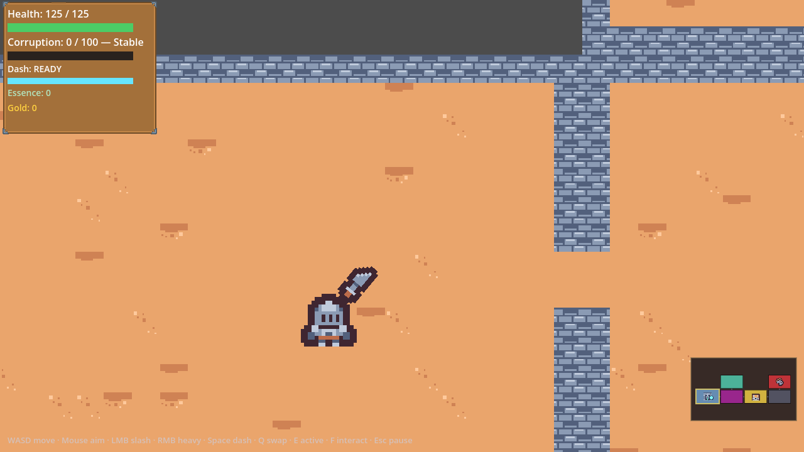
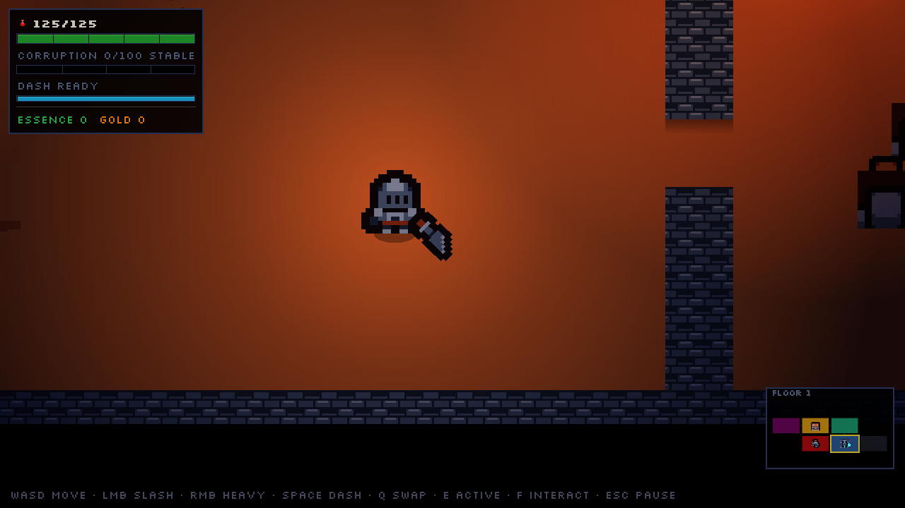
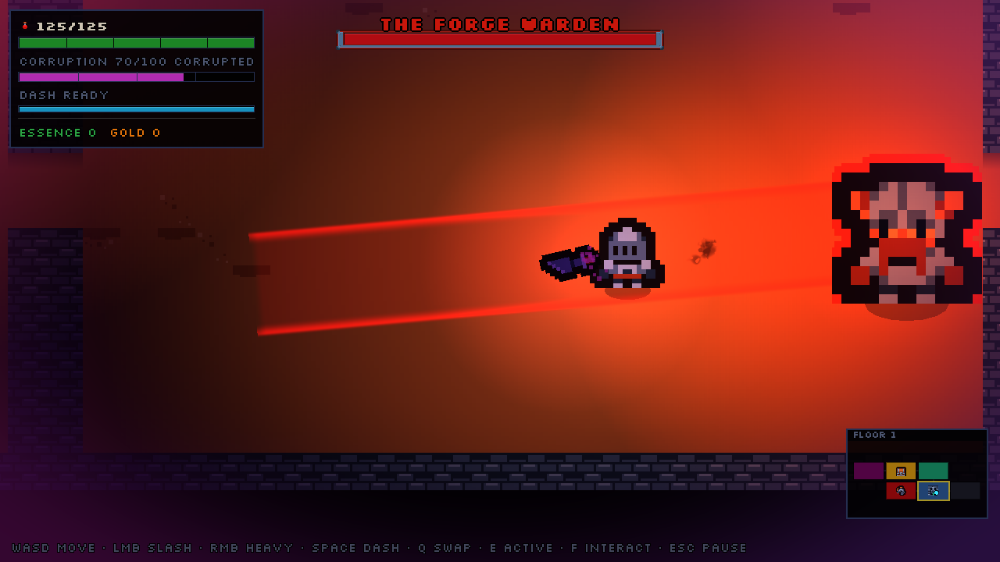
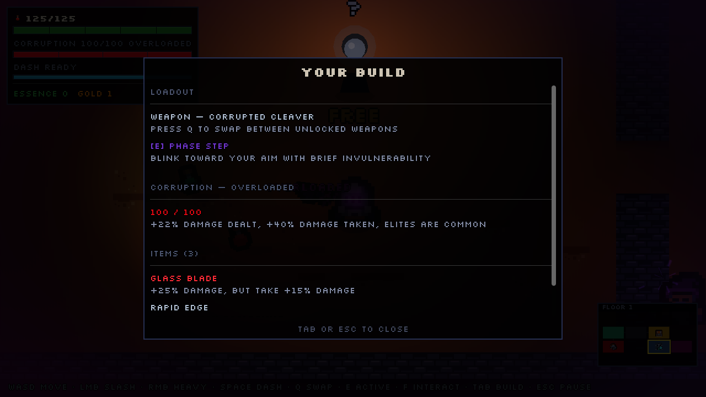

# Visual Polish — Research, Plan & Implementation Record

**The Last Forge** · Godot 4.7 (Mobile renderer) · written 2026-07-26 · **all
of it implemented the same day**

The game plays well and is mechanically dense. The *look* was the part that read
"prototype." This document started as the research pass — what's wrong, what
fixes it, in what order — and is now also the record of what shipped.

> **Status: complete.** Every item in the plan below was built. §10 lists what
> was added, what changed from the plan, and the handful of things deliberately
> done differently once they were tested for real.

| Before | After |
|---|---|
|  |  |

---

## 0. How this was assessed

Rather than guess, the game was run for real and frames were captured
(`get_viewport().get_texture().get_image().save_png()` from a throwaway driver
scene, since the editor isn't needed for this). Candidate techniques were then
applied live to the running scene and re-captured, so the A/B below is this
project's own art, not a stock demo.

Everything marked **✅ verified** was run on this machine, on this project,
under the Mobile renderer + D3D12. Everything else is research and is labelled
as such.

---

## 1. Honest read of the current look

| # | What you see | Why it reads as unfinished |
|---|---|---|
| 1 | A large, uniformly-bright tan plane | Zero lighting. Every pixel of floor has identical value, so the room has no depth, no focal point, and no mood. This is the single biggest problem. |
| 2 | Flat grey void outside the room | The camera sees past the room edge to Godot's default clear colour. Instantly says "unfinished level." |
| 3 | Walls sit in the same visual plane as the floor | Top-down brick tiles with no darker face, no cast shadow, no occlusion. Nothing tells you they're tall. |
| 4 | Default Godot sans-serif font, everywhere | HUD, banners, cards, hint line. Pixel-art sprites + a modern UI sans is the loudest possible "made in an engine, untouched" signal. |
| 5 | Bars are raw `ColorRect`s | Hard 1px edges, flat fills, no frame, no ticks, no icon. The empty corruption bar reads as a broken widget rather than "0%". |
| 6 | Floor decoration reads as noise | Scattered single-tile smears at even density. It doesn't build texture; it looks like dirt on the lens. |
| 7 | Minimap is a bare black rectangle | No frame, no label, jammed against the screen edge, no visual relationship to the rest of the HUD. |
| 8 | Colour palette is uncoordinated | Tan floor + blue-grey walls + saturated green HP + cyan dash + gold + magenta rarity. Six unrelated hues, no grading pass tying them together. |
| 9 | Status banner floats naked over the play field | Large white text with no backing plate — low contrast over light floor, and it fights the game. |
| 10 | Camera zoom is `2.8` | Non-integer scale on 16px tiles → pixels render at 44.8px, so pixel sizes are uneven across the sprite. |

Nothing here is a bug. Items 1–3 are *absent systems*; 4–10 are polish debt.

---

## 2. The plan, ranked

Impact is "how much better does the game look to someone seeing it for 5
seconds." Effort assumes you already know the codebase.

| Rank | Change | Impact | Effort | Risk | Tier |
|---|---|---|---|---|---|
| 1 | 2D lighting: `CanvasModulate` + torch + brazier lights | ★★★★★ | ~2h | Low | 1 |
| 2 | Replace the default font (one line in `ui_theme.tres`) | ★★★★☆ | ~30m | None | 2 |
| 3 | Kill the grey void behind the room | ★★★☆☆ | ~20m | None | 4 |
| 4 | Wall depth: dark face row + floor shadow strip | ★★★★☆ | ~1.5h | Low | 4 |
| 5 | Bars: framed, ticked, iconed | ★★★☆☆ | ~2h | Low | 2 |
| 6 | `WorldEnvironment` glow + `hdr_2d` | ★★★☆☆ | ~1h | Medium | 1 |
| 7 | Sprite outline shader (telegraph / elite / interactable) | ★★★☆☆ | ~1h | Low | 3 |
| 8 | Colour grading pass in `screen_fx` | ★★★☆☆ | ~1h | Low | 3 |
| 9 | Dissolve-on-death shader | ★★☆☆☆ | ~1h | Low | 3 |
| 10 | Y-sorting so things overlap correctly | ★★☆☆☆ | ~30m | Low | 4 |
| 11 | Minimap + banner + card layout treatment | ★★★☆☆ | ~2h | Low | 2 |
| 12 | Screen-space shockwave on heavy hits | ★★☆☆☆ | ~1.5h | **Medium** | 3 |

---

## 3. Tier 1 — Lighting and atmosphere

### ✅ Verified in this project

The Mobile renderer supports the full 2D light pipeline, and it works here
today. The flat plane becomes a warm pool of light falling off into a cool dark
floor, and the player becomes the focal point of the frame for free.

**Shipped values** (found by iterating — the first pass at ambient `0.42` /
energy `1.5` blew out to white, because the tan floor is already very bright, so
lights have almost no headroom above it):

```gdscript
# Ambient — cool and dark so warm lights have somewhere to go.
# scripts/Atmosphere.gd BASE
CanvasModulate.color   = Color(0.38, 0.37, 0.52)

# Player torch (scenes/Player.tscn > Torch).
PointLight2D.texture       = res://light_radial.tres
PointLight2D.texture_scale = 1.8      # must fit the VIEW, not the room
PointLight2D.energy        = 0.80
PointLight2D.color         = Color(1.00, 0.88, 0.70)

# Wall braziers (Dungeon._place_brazier).
PointLight2D.texture_scale = 1.5
PointLight2D.energy        = 0.85
PointLight2D.color         = Color(1.00, 0.60, 0.25)
```

One non-obvious constraint: the torch's radius has to be smaller than the
visible area or the falloff happens off-screen and the whole view just reads as
uniformly lit again. At zoom 3 the camera sees ~427×240 world px, so a torch
radius over ~210 has no visible edge. This is why `texture_scale` dropped from
the 2.6 that looked right at zoom 2.8.

Go darker than feels comfortable in isolation — the light does the work of
making it readable, and the contrast is the whole point.

### Implementation sketch

**Ambient.** One `CanvasModulate` under `CombatRoom` (in `CombatRoom.tscn`, so
it's visible in the editor). It affects the 2D canvas only — the HUD lives on a
`CanvasLayer` and is correctly untouched, ✅ confirmed in the captures above.

**Player torch.** A `PointLight2D` child of `Player.tscn`. The radial texture
can be a `GradientTexture2D` resource saved to disk rather than built in code:

```gdscript
var grad := Gradient.new()
grad.set_color(0, Color(1, 1, 1, 1))
grad.set_color(1, Color(1, 1, 1, 0))
var tex := GradientTexture2D.new()
tex.gradient  = grad
tex.width     = 256
tex.height    = 256
tex.fill      = GradientTexture2D.FILL_RADIAL
tex.fill_from = Vector2(0.5, 0.5)
tex.fill_to   = Vector2(1.0, 0.5)
```

**Braziers.** `Dungeon._place_brazier()` already builds a `Node2D` + `Sprite2D`
+ flame `CPUParticles2D`. Add a `PointLight2D` sibling there and the room lights
itself. Give it a subtle flicker by driving `energy` from a sine in `_process`
(*not* a looping `Tween` — see the leak gotcha in the project notes).

**Tie lighting to the game's actual theme.** This is where it stops being
decoration and starts being design:

- **Corruption drives the ambient.** Lerp `CanvasModulate.color` from the neutral
  dungeon blue toward the corruption purple already used in `screen_fx`. The
  room itself gets sicker as you get stronger — that's the core fantasy,
  rendered.
- **Room type sets the palette.** Treasure = warm gold, Shop = candle-lit,
  Altar = cold violet, Boss = red-hot, Entrance = neutral. `RoomController`
  already knows the room type; one lerp per room transition and every room type
  becomes visually identifiable before you read a single word.
- **The player's weapon glows.** A small `PointLight2D` on `WeaponSprite`
  tinted by corruption, pulsing on swing. Free feedback, no new UI.
- **Attacks light the room.** A one-shot light on `SlashWave` / heavy hits.
  Cheaper and more readable than more particles.

**Shadows (optional, higher cost).** `LightOccluder2D` on wall segments makes
walls actually block light. `Dungeon` already builds walls as merged row-spans
with `RectangleShape2D` collision — the same rects can spawn occluder polygons
in the same loop. Set `shadow_filter = PCF5`. Worth prototyping *after* the
basic light pass; it's the difference between "lit" and "a dungeon", but it also
multiplies light cost and can look wrong in a top-down view where walls are
drawn as floor-plan tiles rather than elevations.

**Glow.** `WorldEnvironment` + `Environment.background_mode = BG_CANVAS` +
`glow_enabled`. ✅ Verified working under Mobile here. Two routes:

- `rendering/viewport/hdr_2d = true` (the setting exists in this project and is
  currently `false`) plus per-object colour values above 1.0 — precise control
  over *what* glows. Available in Forward+ and Mobile.
- Leave HDR off, use `BG_CANVAS`, and tune `glow_hdr_threshold` — cheaper, but
  it's a blunt "everything bright glows."

Start conservative: `glow_intensity = 0.55`, `glow_bloom = 0.05`,
`glow_hdr_threshold = 1.0`. Glow is very easy to overdo, and on a bright tan
floor it turns to soup fast.

### Gotchas

- **Lights don't render headless.** The usual `--headless --quit-after`
  validation will confirm nothing about how this looks. Validate visually — the
  screenshot-driver approach used for this doc works well and is repeatable.
- **Keep the HUD on its `CanvasLayer`.** It already is. If UI ever moves into
  world space it will start glowing and getting darkened.
- **Compatibility renderer** has a reduced glow implementation (no Levels,
  Strength, Blend Mode, Mix, Map). Not an issue today — this project is Mobile —
  but it matters if the course ever targets web export.
- **Pixel-art light edges.** Light falloff is computed at screen resolution, so
  it's smooth even with `default_texture_filter = Nearest`. If you want the
  light itself chunky, snap `LIGHT_VERTEX` in a `canvas_item` shader.
- Large lights cost more (they touch more pixels). Prefer several small lights
  over one huge one.

---

## 4. Tier 2 — Typography and the UI system

### The font is the highest ratio change in the whole document

`ui_theme.tres` currently skins `Button` and `Panel` only. It sets **no default
font**, so every `Label` in the game — HUD, banners, cards, death screen —
renders in Godot's built-in sans. Against 16px pixel-art sprites, that single
mismatch does more damage than every other UI issue combined.

Fix is one property:

```
[resource]
default_font      = ExtResource("font")
default_font_size = 16
```

Candidates, all free for commercial use:

| Font | Licence | Notes |
|---|---|---|
| **Kenney Fonts** | CC0 | Matches the art you're already using — same author as the tiles, UI pack, and icons. Safest choice for a course. |
| **m5x7** / **monogram** (itch.io) | CC0 | Very legible small pixel fonts, popular in roguelites. |
| **Pixel Operator** | CC0 | Wide weight range including bold — useful for hierarchy. |

**Sizing rule.** Pixel fonts only look right at integer multiples of their
native size. Current sizes are `13, 14, 16, 18, 20, 24, 26, 32, 44` — an
unstructured spread. Replace with a scale locked to the font's native size, e.g.
for a 8px-native font: `16 / 24 / 32 / 48` (body / label / heading / title).
Fewer steps read as more deliberate, not less.

### Expand the theme instead of overriding per node

`HUD.gd` is full of `add_theme_font_size_override()` / `add_theme_color_override()`
calls, and `Main.tscn` is full of `theme_override_*` properties. That works, but
it means the look is scattered across ~30 sites and can't be changed in one
place. Moving these into `ui_theme.tres` as named type variations
(`Label/HeaderLarge`, `Label/Stat`, `Label/Danger`) gets you:

- one file to restyle the whole game,
- consistency for free,
- and a genuinely good teaching moment for the course — this is exactly what
  Theme resources are *for*.

Worth adding to the theme: `Label` (font, sizes, colours, outline), `ProgressBar`
(if bars migrate), `PanelContainer`, `Button` focus/disabled states, and
`constants/*_separation` so spacing stops being magic numbers in code.

**Text outline.** `Label` supports `font_outline_color` + `outline_size` via
theme. A 1–2px dark outline on every HUD label solves readability over both the
bright floor and the darkened lit floor permanently, and it's a single theme
entry. Do this — it's ~5 minutes and it fixes the status banner problem (#9)
without adding a backing plate.

### Bars

Three raw `ColorRect`s stacked to fake a bar with a trailing chip. It works, but:

- Swap to `TextureProgressBar` (or a `NinePatchRect` frame over the existing
  rects if you want to keep the lerp/ghost logic in `HUD.gd`) so the bar has an
  actual frame and end caps.
- **Segment the health bar** into ticks per 25 HP. Roguelite players read
  "3 hits left" far faster than they read a continuous fill or "125 / 125".
- **Add icons.** `Assets/Icons/PNG` has UI/controller glyphs but no heart/gem
  (per the asset notes), so either pull a small icon set or reuse tile sprites:
  the potion tile for HP, the gem for gold, the sword for weapon.
- The corruption bar at 0% currently reads as a broken empty widget. Give the
  track a visible inner shadow and a tick at each tier threshold so the *scale*
  is legible even when the fill is empty.

### Layout and hierarchy

The stat panel is a fixed 246×212 `Panel` with a `VBoxContainer` positioned by
hand next to it. Two consequences: the panel can't grow with its contents (which
is why it was manually extended to 214px when gold/active rows were added), and
the padding is eyeballed.

Restructure as `PanelContainer > MarginContainer > VBoxContainer`. The panel
then sizes itself, margins are one theme constant, and adding a row never
requires touching a number again.

Then apply hierarchy: right now every label is the same weight and colour, so
your eye has nothing to grab. Health is the only thing a player checks
mid-fight — make it visually dominant and demote essence/gold to a compact row.

### Motion timings

Research consensus for UI feel, and a good rule to teach:

- **Entrance / exit animations: 150–200ms.** Anything past ~400ms reads as lag.
- **Feedback (button press, pickup, health change): 80–120ms.** The
  input→feedback gap is what "responsive" actually means.

The existing `_punch()` scale-pops and card fly-ins are already in this range —
worth codifying the numbers as constants so new UI inherits the same rhythm.

### Minimap, banner, cards

- **Minimap**: give it the same `NinePatchRect` frame as the boss bar, a
  "FLOOR 3" caption, and 12–16px more inset from the screen corner.
- **Status banner**: with a theme-level text outline it can stay plate-less;
  otherwise a `NinePatchRect` behind it.
- **Upgrade cards**: add an icon slot above the title (reuse the weapon/prop
  tiles), tint the *frame* by rarity rather than only the title text, and fix
  the vertical rhythm — currently there's a dead gap between title and body
  because the description is centred in a fixed-height box.

---

## 5. Tier 3 — Shaders worth writing

The project has two shaders today: `flash.gdshader` (hit flash) and
`screen_fx.gdshader` (UV-only mood overlay). Both are good. Here's what's worth
adding, in value order.

### 5.1 Sprite outline — **highest value**

One shader, at least four uses: telegraph an enemy's wind-up, mark corrupted
elites, highlight the interactable pedestal you're standing on, and rim-light
the player. Right now all of those are communicated by `modulate` tints, which
compete with the hit flash and with corruption tinting.

```glsl
shader_type canvas_item;

uniform vec4  outline_color : source_color = vec4(1.0, 0.9, 0.4, 1.0);
uniform float outline_width : hint_range(0.0, 8.0) = 1.0;
uniform float enabled : hint_range(0.0, 1.0) = 0.0;

void fragment() {
    vec4 col = texture(TEXTURE, UV);
    vec2 px  = TEXTURE_PIXEL_SIZE * outline_width;
    // 4-tap cross; use 8 taps if you want rounded corners.
    float a = 0.0;
    a = max(a, texture(TEXTURE, UV + vec2( px.x, 0.0)).a);
    a = max(a, texture(TEXTURE, UV + vec2(-px.x, 0.0)).a);
    a = max(a, texture(TEXTURE, UV + vec2(0.0,  px.y)).a);
    a = max(a, texture(TEXTURE, UV + vec2(0.0, -px.y)).a);
    float rim = clamp(a - col.a, 0.0, 1.0) * enabled;
    COLOR = mix(col, outline_color, rim);
}
```

**Gotcha:** the sprite must have padding around the art or the outline gets
clipped at the texture edge. The Kenney 16px tiles are tight to the frame, so
either enable `region` with margin, or set the `Sprite2D` to a slightly larger
`AtlasTexture`, or accept clipped edges on the outermost pixels.

This has to compose with `flash.gdshader`. Cleanest path: merge both into one
`sprite_fx.gdshader` with `flash_amount` *and* `outline_*` uniforms, so a sprite
only ever has one `ShaderMaterial`. That's a small refactor of `Juice.flash()`
and worth doing before either grows.

### 5.2 Colour grading in `screen_fx`

Problem #8 (uncoordinated palette) is fixable in ~20 lines without touching a
single asset. Add a grade stage to the existing overlay: lift the shadows toward
a cool blue, push highlights warm, pull global saturation down ~10%. Everything
in the frame then shares a colour identity.

`screen_fx.gdshader` is currently *deliberately* UV-only (no screen texture) so
it compiles headless and can never black-screen. Grading needs to read the
screen, which breaks that guarantee — so **add it as a separate node**, don't
modify `screen_fx`. Keep the safe overlay safe.

```glsl
shader_type canvas_item;
uniform sampler2D screen_tex : hint_screen_texture, filter_nearest;
uniform float saturation = 0.92;
uniform vec3  shadow_tint : source_color = vec3(0.10, 0.12, 0.22);
uniform vec3  hilite_tint : source_color = vec3(1.06, 1.00, 0.92);

void fragment() {
    vec3 c = texture(screen_tex, SCREEN_UV).rgb;
    float l = dot(c, vec3(0.299, 0.587, 0.114));
    c = mix(vec3(l), c, saturation);
    c = mix(c * (1.0 - shadow_tint) + shadow_tint * 0.35, c * hilite_tint, l);
    COLOR = vec4(c, 1.0);
}
```

### 5.3 Dissolve on death

Enemies currently gib + white-flash + fade `modulate.a`. A dissolve driven by a
noise texture (burn away from the hit direction, with a bright edge at the
dissolve boundary) is a strict upgrade and thematically on-point for a forge.
Same shader also works for pickup collection and the item-pedestal take.

### 5.4 Screen-space shockwave — **do this last**

A radial UV distortion ring on heavy hits / boss slams. Genuinely impressive,
but it's the riskiest item here:

- Needs `hint_screen_texture`, so it inherits the black-screen risk you
  deliberately engineered out.
- In 2D, the screen is copied to the back-buffer once, at the *first* node that
  reads it. Two overlapping screen-reading nodes will not see each other's
  output unless you put a `BackBufferCopy` between them. With grading (5.2) also
  reading the screen, ordering matters and gets fiddly.
- It'll be the first thing to break on a different renderer.

Worth it, but only after the rest is stable, and behind an easy off switch.

### 5.5 Heat haze on braziers

Small localised UV wobble above each flame. Same screen-texture caveat, much
smaller blast radius. Cheap way to make the light sources feel hot.

### 5.6 Argued against: CRT / scanlines

Popular, tempting, and wrong for this game. It fights the clean Kenney art,
costs legibility on an already-busy HUD, and dates the look. If you want retro
signalling, get it from palette and typography, not from a filter.

---

## 6. Tier 4 — Render hygiene

Cheap fixes with a good ratio. Do these alongside Tier 1.

**The grey void.** Three options, cheapest first: set a dark
`rendering/environment/defaults/default_clear_color`; or draw a large dark
`ColorRect` / tiled "bedrock" `TileMapLayer` behind the dungeon; or set
`Camera2D` limits per room so the camera never shows past the walls. The middle
option looks best — a dark stone texture behind the room sells "underground."

**Wall depth.** The single biggest cheap upgrade after lighting. Two parts:
1. A darker "face" tile row along the bottom edge of every wall run, so walls
   have visible height.
2. A soft shadow strip on the floor at the base of walls. `Dungeon` already
   draws inner-border shadow strips — extend that idea to every wall span, not
   just the room border.

**Y-sorting.** No `y_sort_enabled` anywhere in the project. Enable it on the
container holding player/enemies/props so things overlap by depth instead of by
tree order. Sub-30 minutes, and it removes an entire class of "the player is
standing in front of a wall he's behind" weirdness.

**Camera zoom.** `2.8` on 16px tiles gives 44.8px tiles — uneven pixel widths.
Move to `3.0` (48px, exact) and enable
`rendering/2d/snap/snap_2d_transforms_to_pixel`. Note this narrows the visible
area by ~7%, so check that rooms still frame correctly — `Dungeon`'s slot sizes
(26×16) were chosen to fit the screen, so this may need a slot tweak.
Keep `stretch/mode = canvas_items` (correct for this project — it keeps the
camera smooth and the UI crisp; `viewport` mode would pixelate the HUD too).

**Floor decoration.** Currently even-density single-tile scatter, which reads as
noise. Cluster it instead: pick a few seed points per room and place 3–6 decor
tiles around each, leaving large clean areas between. Contrast is what makes
texture legible.

**Contact shadows.** Boulders have ellipse drop shadows; the player and enemies
don't. A small dark ellipse under every moving sprite is one of the strongest
"grounded, not floating" cues in top-down 2D, and it costs almost nothing.

---

## 7. Suggested sequencing

Three batches. Each ends somewhere shippable.

**Batch A — "the room has mood" (~1 day)**
1. Font in `ui_theme.tres` + text outline
2. `CanvasModulate` + player torch + brazier lights
3. Kill the grey void
4. Contact shadows + y-sorting

Biggest visible delta for the least work. Items 1 and 2 alone change the first
impression completely.

**Batch B — "the UI is designed" (~1 day)**
5. Theme expansion + type scale + kill the scattered overrides
6. Bar treatment (frames, ticks, icons)
7. Minimap frame, banner, card layout
8. Wall depth + floor decoration clustering

**Batch C — "it has a look" (~1 day)**
9. Outline shader (merge with flash into `sprite_fx.gdshader`)
10. Corruption/room-type driven light colour
11. Colour grading pass
12. Glow + `hdr_2d`
13. Dissolve deaths
14. *If everything is stable:* shockwave, heat haze, light occluders

**Validation.** Lighting and shaders are invisible to headless runs. Keep the
screenshot-driver pattern from §0 as a repeatable look-check: instance
`Main.tscn`, walk the player, capture named PNGs, quit. Run it after each batch
and diff the frames.

---

## 8. Risks and non-goals

- **Don't touch `screen_fx.gdshader`'s UV-only guarantee.** It exists for a
  reason. Screen-reading effects go in new nodes.
- **Darkness vs. readability.** Enemy telegraphs are red flashes; if ambient
  goes too dark they stop reading. Test the boss room specifically, and consider
  exempting telegraph sprites from lighting via `light_mask` / a light-ignoring
  material.
- **Glow + a bright tan floor is a trap.** Threshold it high or it becomes haze.
- **Scope.** This is all *rendering* polish on existing assets. No new art is
  proposed, which is deliberate — every item above works with the Kenney tiles
  already in the project.
- **Course impact.** Lighting and Theme resources both map cleanly to new
  lessons; the shader work is a natural "Part 16: Making It Look Good" chapter
  after the existing juice lesson. Worth deciding up front whether these become
  taught lessons or just polish, because that changes how much of it should be
  built in code (teachable, greppable) vs. configured in the editor (faster,
  but invisible in a tutorial).

---

## 9. References

**Godot documentation**
- [2D lights and shadows](https://docs.godotengine.org/en/stable/tutorials/2d/2d_lights_and_shadows.html) — `CanvasModulate`, `PointLight2D`, occluders, shadow filters, pixel-art light snapping via `LIGHT_VERTEX`
- [Environment and post-processing](https://docs.godotengine.org/en/stable/tutorials/3d/environment_and_post_processing.html) — glow support per renderer; 2D glow via HDR 2D or `BG_CANVAS`
- [Screen-reading shaders](https://github.com/godotengine/godot-docs/blob/master/tutorials/shaders/screen-reading_shaders.rst) — `hint_screen_texture` and the `BackBufferCopy` ordering rule
- [Custom post-processing](https://docs.godotengine.org/en/stable/tutorials/shaders/custom_postprocessing.html)
- [CanvasItem shader reference](https://docs.godotengine.org/en/stable/tutorials/shaders/shader_reference/canvas_item_shader.html)

**Setup and technique**
- [Setting up pixel art graphics in Godot 4 — GDQuest](https://www.gdquest.com/library/pixel_art_setup_godot4/)
- [Project settings for a pixel art game in Godot](https://witchcabingames.itch.io/truthbane/devlog/1006819/project-settings-for-a-pixelart-game-on-godot) — HDR + pixel snap
- ["Finally glowing! (with Godot 4.4)"](https://initdotdev.itch.io/puzzle-crossing/devlog/903593/finally-glowing-with-godot-44) — the HDR 2D threshold fix
- [Light and Shadow — True Top-Down 2D (Catlike Coding)](https://catlikecoding.com/godot/true-top-down-2d/4-light-and-shadow/)
- [Realtime 2D lighting with shadows in Godot 4.4](https://www.connorwolf.com/post/realtime-2d-lighting-with-shadows-on-isometric-tiles-in-godot-4-4)

**Shaders**
- [Efficient 2D pixel outlines](https://godotshaders.com/shader/efficient-2d-pixel-outlines/)
- [Dissolve / add details, pixel art](https://godotshaders.com/shader/dissolve-add-details-pixel-art/)
- [Palette swap (post-process)](https://godotshaders.com/shader/palette-swap-post-process-image-parametrized/)
- [godotshaders.com — pixel-art tag](https://godotshaders.com/shader-tag/pixel-art/)

**UI and assets**
- [Godot 4 Tween Tutorial (Game Juice) — Coding Quests](https://codingquests.io/blog/godot-4-tween-tutorial-juice)
- [Kenney Fonts (CC0)](https://kenney.nl/assets/kenney-fonts) · [Kenney Pixel UI Pack (CC0)](https://kenney.nl/assets/pixel-ui-pack)
- [CC0 fonts on itch.io](https://itch.io/game-assets/assets-cc0/tag-fonts) — m5x7, monogram
- [Godot 4 visual design / art direction guide](https://artofstyleframe.com/blog/godot-game-art-visual-design-guide/) — UI animation timing figures

**Engine version**
- [What's new in Godot 4.7](https://godotlearning.com/blog/godot-4-7-whats-new) — `DrawableTexture2D` (useful later for fog-of-war or a drawn minimap), conic `GradientTexture2D`, `TextureRect` AtlasTexture tiling

---

## 10. Implementation record

Everything above shipped. This section is what actually exists now, and where
reality diverged from the plan once things were tested on screen.

### New files

| File | What it is |
|---|---|
| `Assets/Fonts/Silkscreen-{Regular,Bold}.ttf` | The game's font (SIL OFL, `OFL.txt` included). Imported with antialiasing/hinting/subpixel off. |
| `light_radial.tres` | Shared soft radial falloff — the texture on every `PointLight2D`. |
| `fx_quad.tres` | Blank 64×64 white quad. Every procedural FX shader ignores its texture and draws from UV; this just supplies the geometry. |
| `scripts/Atmosphere.gd` | Drives the room ambient from corruption + room type. |
| `scripts/BrazierLight.gd` | Sconce flicker (procedural, not a looping tween) + heat-plume clock. |
| `scripts/StatBar.gd` | Framed, ticked meter widget. Replaces the stacked `ColorRect` bars. |
| `shaders/sprite_fx.gdshader` | Per-sprite flash + outline + dissolve in one material. Replaces `flash.gdshader`. |
| `shaders/grade.gdshader` | Screen colour grade + vignette. |
| `shaders/shockwave.gdshader` | Screen ripple for heavy hits. |
| `shaders/fx_{ring,burst,spark,slash,telegraph,decal,heat}.gdshader` | The procedural VFX set. |
| `tools/lookcheck.{gd,tscn}` | Repeatable visual check — drives real combat and writes named PNGs. |

### Where the plan was wrong

Four things only became visible once they were on screen:

1. **Y-sorting painted the floor over the player's legs.** Enabling `y_sort_enabled`
   on the room put the *tilemap's own tiles* into the same sort list as the
   player, so any floor tile below the player's origin drew on top of them. Fix:
   pin the tiles to `TileData.z_index = -10` in `Dungeon._build_tileset()` —
   Y-sorting only orders within a z-index, so the ground stays ground.

2. **The contact shadow made the player look decapitated at the ankles.** The
   Kenney character tiles are drawn *flush to the bottom edge* of their 16px
   cell, so a shadow centred above that edge draws a dark arc across the
   character's legs. Fix: centre the shadow exactly at the art's bottom edge, so
   the covered half hides behind the sprite and only a ground-contact crescent
   shows. (The flat-bottomed art is the source asset, not a bug — every
   character tile in the pack is like this.)

3. **The first light values blew out to white.** The tan floor tile is bright
   enough that a naive ambient/energy pairing has no headroom. The shipped
   values are much darker than they feel like they should be in isolation.

4. **The slash arc came out as a solid cone.** Varying the crescent's *radius*
   across the arc fills it in; a crescent is a band at a constant radius whose
   *thickness* tapers to points at the ends.

### Deliberately done differently

- **Heat haze is additive, not refractive.** A screen-reading shimmer in world
  space would trigger the single 2D back-buffer copy early, and `grade` — drawn
  later, in the UI layer — would then sample a stale frame. Fixing that needs
  `BackBufferCopy` nodes and careful ordering, for an effect the size of a wall
  sconce. `fx_heat.gdshader` gets most of the read with no ordering hazard.
- **`screen_fx.gdshader` was left alone.** Its UV-only guarantee is why it can
  never black-screen. Grading and the shockwave are separate nodes with their
  own risk.
- **CRT/scanlines still not done**, per §5.6.

### Bugs found and fixed along the way

Three of these were pre-existing and unrelated to the visual work — they
surfaced because the new screenshots made them obvious.

- **Music got permanently louder as you played.** `AudioManager.duck_music()`
  set the Music bus to an absolute dB during slow-mo and then restored it to
  `0.0` — not to the mix level. Since slow-mo fires on wave clears and heavy
  hits, the bus climbed to full volume within seconds and stayed there. Now the
  duck is relative and restores to the configured level.
- **The corruption meter only refreshed when health changed.** `on_stats_changed()`
  never called `_refresh_hud()`, so taking an upgrade visibly cost you nothing
  until your next hit.
- **Two UI glyphs weren't in the font.** `✔` and `⚡` aren't in Silkscreen's
  226-glyph set and would have rendered as tofu; replaced with text.
- Menu buttons stretched to the full container width, because a `VBoxContainer`
  sizes children to its own width and the widest child was a long label.

### Audio and camera (asked for mid-pass)

- Music beds regenerated: peak normalisation `0.6 → 0.34`, low triangle voices
  swapped for sines (their odd harmonics were the buzz), LFOs slowed, and the
  combat track's Bb-against-A minor second — the single most irritating thing in
  the mix — replaced with a G.
- Volume is now player-controlled: **Master / SFX / Music sliders in the pause
  menu**, persisted to the save file. `1.0` means "the level the game was mixed
  at", so the SFX/music balance holds at every setting.
- Camera: the aim-lead is now damped separately from the follow (raw mouse
  position was being fed straight into the follow target, so every flick
  twitched the view), every decay is `1 - exp(-rate * delta)` so motion is
  identical at 60 and 144 fps, and zoom moved `2.8 → 3.0` so 16px tiles land on
  whole pixels.

### Validating this work

Lighting, shaders and UI are all invisible to `--headless`. Use the look-check:

```
Godot_v4.7-stable_win64.exe --path . res://tools/lookcheck.tscn \
    --resolution 1280x720 --quit-after 7000
```

It walks the player, spawns enemies, swings, telegraphs, kills them, opens the
upgrade screen, pause menu and death screen, then loads the title and hub —
writing named PNGs to `user://shots/`. Diff those between passes.

The usual headless run still applies for parse/scene errors, and remains clean:
the only reported "leaks" are the in-flight music stream at force-quit, which is
a harness artifact.

---

## 11. Second pass — readability in the dark

Making the dungeon dark created a problem the plan hadn't anticipated: **anything
outside the torch radius became a black silhouette on a black floor.** Enemies
could close on you unseen, and dropped loot was invisible. That's a fairness
problem, not a look problem, and it needed fixing before the lighting could be
called done.

The fix is consistent: **everything that matters emits its own light**, tinted to
what it is.

| Thing | Light | Why that colour |
|---|---|---|
| Health / cleanse / gold pickups | tinted to `fx_color`, pulses with the bob | Tells you *what* the drop is from across the room |
| Grunt | sickly green | Matches the ghoul sprite |
| Charger | hot red | Reads as "aggressive, closing fast" |
| Caster | arcane violet | Same hue as its projectiles |
| Brute | big orange ember | Size of the light telegraphs the size of the threat |
| Skitterling | small pale yellow | Weak and quick |
| Boss | forge-hot orange, large | It's called the Forge Warden |
| Corrupted elite | violet, ~2× brighter | Already had a violet rim; the light matches |
| Caster projectile | violet | You see an incoming bolt's glow before its sprite |

This is the payoff of building the lighting properly: the *same* system that
made the room atmospheric now carries gameplay information, and the enemy
roster is identifiable at a glance by colour alone.



### Also fixed in this pass

- **Effects were sized as if the camera were at 1:1.** A "spark" quad at 96
  world px is a 288px streak at zoom 3 — on screen it read as a searchlight
  beam, not debris. Burst and spark quads scaled down to `0.85×` / `0.7×`.
- **Big enemies had base-sized contact shadows.** Brute (2.5×), Skitterling
  (1.5×) and the Boss (4×) scale their *Sprite2D*, not their root, so the
  shadow stayed small and floated in the middle of the body. Each now has a
  shadow sized to its own sprite.
- **Inherited enemy scenes carried stale child indices.** Adding `ContactShadow`
  at index 0 in `EnemyBase.tscn` shifted everything down. Godot resolves these
  by name so nothing broke, but the indices were corrected rather than left as
  a trap.
- **Weapon trail** got a width curve and a gradient — widest and white-hot at
  the blade tip, tapering to nothing at the oldest point. A uniform-width
  `Line2D` reads as a drawn stroke; this reads as motion.
- **Deleted `scripts/DungeonRoom.gd`** (~250 lines) — fully replaced by
  `Dungeon.gd` in the round-4 roguelike expansion and referenced by nothing.

### Judgement calls left alone

- **Player footstep dust** — considered and skipped. In a torch-lit room it
  would be nearly invisible and costs a spawn per few frames.
- **Shader-based scene transitions** (wipes/dissolves instead of the black
  fade). Real polish, but `Transitions` is load-bearing for every scene change
  and the current fade is clean. Not worth destabilising as an afterthought.

---

## 12. Third pass — a real bug, and explaining the build

Two things reported from play.

### Phase Step could teleport you out of the world

`_active_phase_step()` did exactly this:

```gdscript
global_position += dir * 165.0
```

A raw teleport with **no collision test at all** — it would happily land you
inside a wall, inside a locked gate, or outside the dungeon entirely.

Fixed by sweeping the player's own collision shape along the path and stopping
at the last safe point:

```gdscript
var params := PhysicsShapeQueryParameters2D.new()
params.shape          = <the player's CollisionShape2D shape>
params.transform      = Transform2D(0.0, global_position)
params.motion         = dir * PHASE_STEP_DISTANCE
params.collision_mask = 1          # world geometry ONLY
params.exclude        = [get_rid()]
var fractions := get_world_2d().direct_space_state.cast_motion(params)
var landed := global_position + dir * PHASE_STEP_DISTANCE * fractions[0]
```

Masking **only** layer 1 is the important detail: the ability keeps its
identity — you still phase through *enemies*, you just can't phase through
*walls*. That also stops it skipping the locked gates that hold you in a combat
room, which would otherwise have been a progression exploit.

Verified by asking for a 4000px blink into a wall and confirming it travelled
~130px and stopped. `tools/lookcheck.gd` prints `BLINK_TEST` on every run so
this can't silently regress.

### [Tab] — "what does Ember Brand do again?"



The upgrade cards explain an item exactly once, at the moment you take it, and
then that information is gone. By floor three you're carrying eight items and
can only remember the names, so the build stops being something you reason
about.

**Tab** now opens a build screen (pauses; Tab or Esc closes) showing:

- **Loadout** — current weapon, and the [E] active with what it does
- **Corruption** — the tier *and the actual numbers it's applying to you*, which
  were previously invisible during play
- **Items** — every item, stacked with counts, rarity-coloured, each with its
  description
- **Synergies** — live synergies and what they do

Supporting data added: `PlayerController.SYNERGY_DESCS` and `ACTIVE_DESCS`
(both previously had display names but no explanation anywhere), plus
`synergy_entries()` / `active_description()` accessors.

Two implementation notes worth keeping:

- **Tab is handled in `_input()`, not `_unhandled_input()`.** Tab is also
  Godot's built-in `ui_focus_next`, so once any Control has focus — which
  happens the moment you've opened the pause menu once — the GUI layer eats the
  key before `_unhandled_input` ever runs.
- **The SFX pool is now `PROCESS_MODE_ALWAYS`.** Menus pause the tree, so every
  UI click sound (including the existing pause menu's) was being silently
  swallowed. That was a pre-existing bug the build screen surfaced.

---

## 13. Item / power audit

"Do all the items actually work?" isn't answerable by reading definitions — an
item can apply cleanly and still be completely inert if nothing reads the stat
it sets. So this is checked by two automated suites that drive the real game.

### `tools/itemcheck.tscn` — 80 checks

```
Godot_v4.7-stable_win64.exe --headless --path . res://tools/itemcheck.tscn --quit-after 9000
```

Covers, for every one of the 23 items:

1. **Applying it changes observable player state** — catches an item whose
   `apply` silently does nothing.
2. **Passives change BEHAVIOUR, not just a field** — this is the important one.
   Sharpened Edge must raise what `_compute_damage()` returns; Wider Cleave must
   physically grow `hitbox_shape`; Berserker must *only* boost below 40% HP;
   Corrupted Aura must damage a nearby enemy with no input; Maelstrom must
   centre the heavy hitbox on the player.
3. **On-hit effects reach the enemy** — burn ticks damage, chill sets the slow
   factor, execute kills a low-HP target, Storm Coil arcs to a *second* enemy,
   Twin Fang lands a delayed second blow, Echo Blade spawns real `SlashWave`s.
4. **Actives** — Forge Pulse damages, Blood Siphon damages *and* heals, Phase
   Step moves the player and stays inside the dungeon.
5. **Synergies** fuse from exactly their required pair, and not from half of it.
6. **Offer integrity** — no duplicates within a draw, always 3 cards, owned
   uniques never re-offered (200 draws), altar deals never offer commons.
7. **Economy** — unaffordable purchases are refused and cost nothing,
   affordable ones deduct, altar deals charge max HP instead of corruption, and
   losing max HP clamps current HP.

Result: **80 pass, 0 fail.** Every item, active, on-hit effect and synergy in
the game is verified working.

### `tools/soak.tscn` — auto-plays 3 floors

```
Godot_v4.7-stable_win64.exe --headless --path . res://tools/soak.tscn --quit-after 40000
```

Walks the player room to room, clears every wave, takes every upgrade, buys from
every shop, takes altar deals, kills bosses and descends — checking nothing
stalls and no engine error is printed. Result: **39 pass, 0 fail, zero engine
errors or warnings** across three floors and 14 accumulated items.

### Bugs this found

- **Enemies survived a floor change.** `_on_boss_cleared()` freed projectiles
  and pickups but not enemies, so anything still alive when the floor changed
  carried over — at its old coordinates, which on the new floor are somewhere
  else entirely (quite possibly inside a wall). Not reachable via the boss today
  (it fires projectiles rather than summoning adds), but it was one boss-add
  away from being a real problem, and the leftovers leaked. Cleanup moved into
  `_enter_floor()` so **every** path that changes floors is covered, and
  `_alive` resets with it. Confirmed by the soak's leak count dropping to the
  baseline.
- **Cleansing Light could be offered as a dead card.** Its entire value is
  removing corruption, so at low corruption it purges nothing and wastes one of
  your three picks. Now held back below `CLEANSE_MIN_CORRUPTION` (12).

Both suites are cheap to run and headless-safe — worth running alongside the
look-check whenever items or the room flow change.
